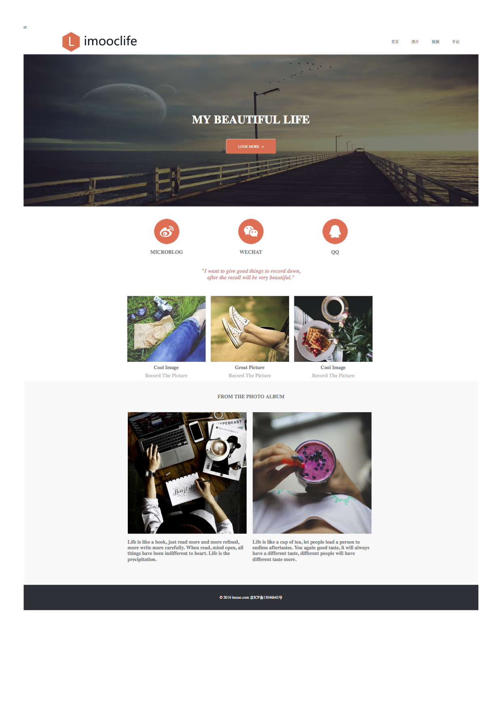
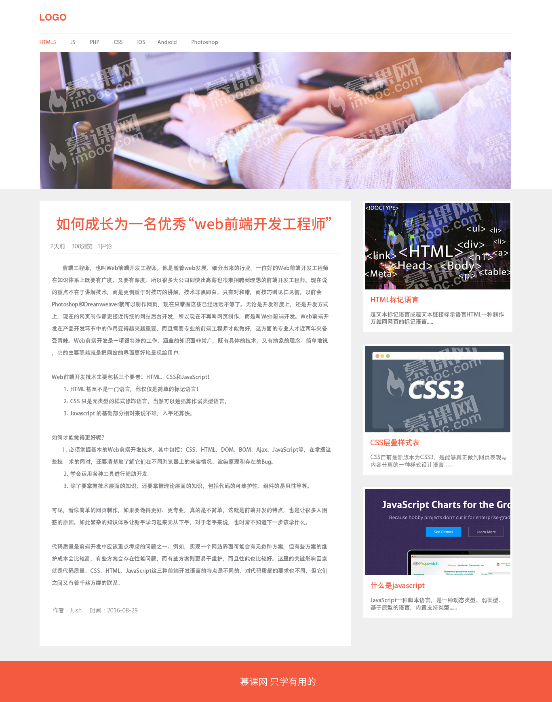

# html-css-demo (html-css 演示范例)
> 展示通过 HTML-CSS 完成的 2 个静态页面案例；

## 1. Project-1-Imooc Life(慕课生活主页)

### 1.1 效果图：

### 1.2 技术点总结

1. 一般而言，**header banner background footer** 都会设置成 width:100%;
2. 可以通过 **ul 实现 menu 菜单**；
3. banner 图中，一般是 3 层结构：**banner-img(最底层), banner-mask-layer(覆盖层), banner-display(顶部显示层)**;
4. 在多列布局中，可以使用 **width:33.33%; 均分**；
5. 当因为使用 **float:left**; 内部 div 跑出外部 div 包裹后，可以使用 clear:both 进行处理；
6. **postion 属性**中，static 和 relative 都不会脱离原来的文档流；但是 absolute 和 fixed 会；其中 fixed 一般用于导航栏跟随。

## 2. Project-2-Tec Life(技术生活主页)

### 2.1 效果图：

### 2.2 技术点总结

